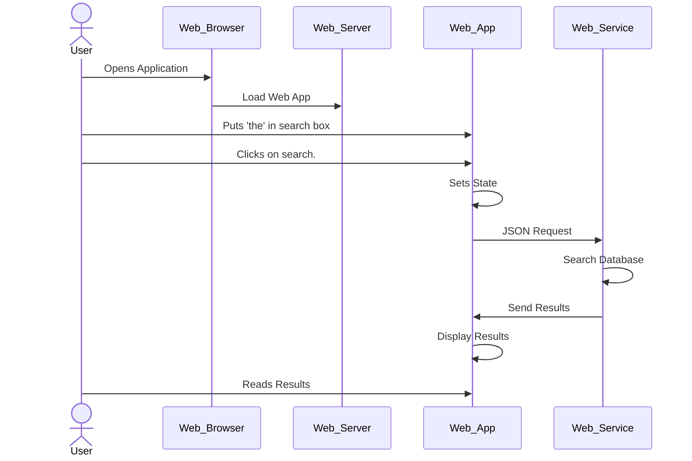
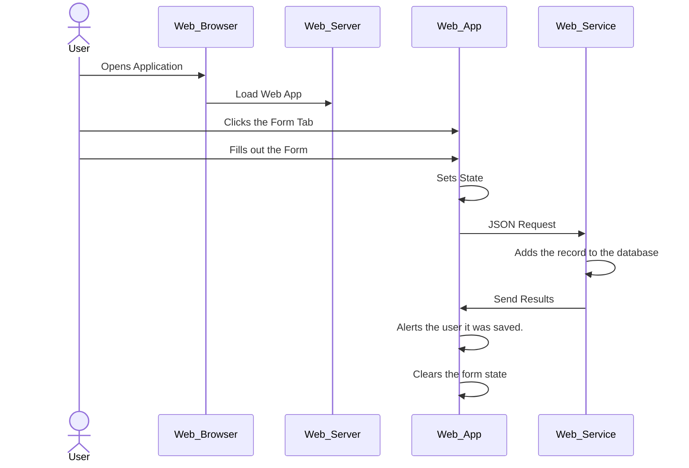

# Study Order

This file outlines an order of files to look through,
and are broken into two sections: front-end (React) and back-end (Go).

## Search Results Use-Case

## Create Data Use-Case

## Front End (React)

All front-end files are located in the react directory.

### Root Directory

Here you'll find the control file called 'package.json'.
This file controls the behavior of react and the dependencies
your project has. This file is auto generated by the 'create-react-app'
NPX command.

### node_modules

This directory is where NPM stores all of the web-app dependencies.

### Public

This directory contains the following files:

1. index.html - This is the entry point for your web application.
2. favicon.ico - Is the icon that displays in the browser next to your URL.
3. logo*.png - Are the logos used for other devices.
4. manifest.json - Is the application descriptor.
5. robots.txt - Instructs web crawlers like search engines how they should behave when reading your contents.

### src (or source)

This is the primary directory you'll work in using React to
describe the behaviors and flows of your application. Files may
be grouped in a directories; Files are generally grouped with
a JavaScript file, CSS, and Test File, all with the same root name.
This helps organize all related operations so you don't have to search
for the relevant information.
For this simple application, the following order is relevant:

1. App.js, App.css, and App.test.js - These are the entry point for the application.
2. State.js - Defines the state objects that are used by the application.These hold values while the user navigates other components.
3. search/SearchForm.js - Defines the search form component.
4. search/SearchResults.js - Defines the component for showing search results.
5. data/DataForm.js - Defines the component that adds new information to the database.

## Back-end

